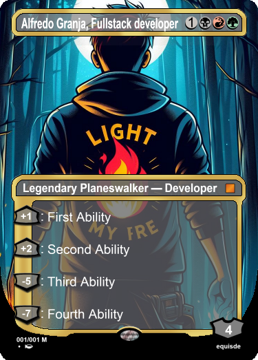

<h1> Hello there, my name is Alredo Granja</h1>
<section >

<h3 width ="50%" align="left">I'm a software Engineer with about four years of experience in frontend and backend development using javascript, node and C#. Creative and passionate to learn new things and meet new people. I
like to create beautiful and useful UI, along with efficient and easy to use systems to provide the user of a joyful and smooth experience</h3>

  <h3>Connect with me: </h3>
  
  
  
  

</section>

 
 
 
 

 

<h2>🔭 I’m currently working on</h2>
<ul>
<li>Project 1</li>
<li>Project 2</li>
<li>Project 3</li>
</ul>
<h2>🌱 I’m currently learning</h2>
<ul>
<li>Learning 1</li>
<li>Learning 2</li>
<li>Learning 3</li>
</ul>
<!--
**AlfredoGJ/AlfredoGJ** is a ✨ _special_ ✨ repository because its `README.md` (this file) appears on your GitHub profile.

Here are some ideas to get you started:

- 🔭 I’m currently working on ...
- 🌱 I’m currently learning ...
- 👯 I’m looking to collaborate on ...
- 🤔 I’m looking for help with ...
- 💬 Ask me about ...
- 📫 How to reach me: ...
- 😄 Pronouns: ...
- ⚡ Fun fact: ...
  -->
